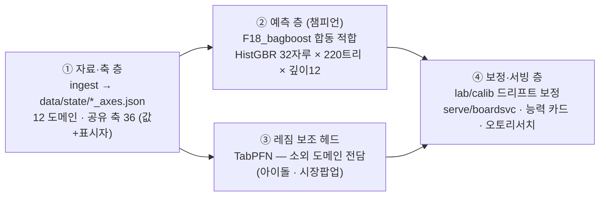

<div align="center">

<picture>
  <source media="(prefers-color-scheme: dark)" srcset="docs/assets/logo-dark.svg">
  
</picture>

# MEGACLAW

### IP 파운데이션 월드모델 — 순위와 확률만 말한다

문화 IP **12개 도메인**의 흥행을 하나의 판 위에서 재고,
예측을 **측정 전에 봉인**하고, 틀리면 틀렸다고 적는 실험실.

<br>


<sub>게임 · 웹툰 · 애니 · 세계애니 · 만화 · 도서 · 영화 · 펀딩 · 아이돌 · 모바일 · 팝업 · 시장팝업</sub>

</div>

---

## 이 실험실이 하는 일

작품 하나가 세상에 나왔을 때 **어디까지 갈지의 순위**를 예측한다.
절대값("관객 몇 명")은 팔지 않는다 — 자릿수를 유의미한 확률로 틀린다는 것을
스스로 측정했기 때문이다. 파는 것은 셋이다.

|  | 무엇 | 조건 |
|:--:|---|---|
| **1** | **순위와 구간** — 도메인 안에서의 상대 위치 | 챔피언 합동 모형 · 판 ρ **0.4710** |
| **2** | **드리프트 보정 절대값** | **자(불확실성 눈금)와 함께만** · 노트 791~809 사슬 |
| **3** | **정직한 능력 카드** | 무엇을 **못 보는지**의 목록까지 포함 |

---

## 🔴 자(尺) — 이 저장소에서 제일 중요한 한 줄

> **채택 문턱이 없으면 문턱이 결론의 부호를 정한다.**
> 같은 자료·같은 팔인데, 자를 바꾸면 같은 결론이 **36%도 되고 146%도 됐다**(노트 890~891).

```
판 ρ            0.4710 ± 0.0021   ← 0.0021 은 SD 다. SE 아님 (SE = 0.000606)
분모            12 도메인 · 유보 3,775 행 · 씨앗 0~11
채택 문턱 2σ    0.00353   (잠정 · 방어 대역 0.00312 ~ 0.00393)
은퇴한 자       0.0045  ← 11 도메인·유보 3,369 시대 유물. 판정에 쓰지 않는다
실격된 자       0.0011  ← 씨앗 잡음만 담아 표본 잡음이 없다
```

문턱은 **"두 팔이 실제로 같을 때 판 Δ 가 흔들리는 폭의 2σ"** 로 정의하고,
**참 Δ = 0 인 널 팔 쌍**(같은 팔의 씨앗 0–5 앙상블 대 6–11 앙상블)으로 실측한다.
씨앗 잡음과 표본 잡음을 **둘 다** 담지 않은 자는 자격이 없다.

> ⚠️ **0.00353 은 아직 '정본'이 아니라 '잠정'이다.** 프레시 티처 세션이
> *"이 실험실이 잰 잡음 바닥(노트 146 · 순수 난수 3열 = 0.0043)보다 낮다"* 를
> 지적했다. 잡음 바닥을 12도메인에서 다시 재는 것이 현재 1순위다.

---

## 지금까지 실측으로 확정된 것

> 이 판의 가장 값진 산출물은 예측력 자체가 아니라 **어디서 무엇이 통하는지의 지도**다.

| 발견 | 근거 |
|---|---|
| 도메인 간 "공유 장(場)"은 얇다 — 진폭·시간을 다 빼야 곡선이 겹친다 | 노트 813~818 |
| 합동 모형은 공유 기저를 안 쓴다 — 정렬은 사실상 한 축(`target_breadth`) | 노트 819 |
| 시간 갈림에서 **단순 릿지가 전이를 이긴다** — 전이의 가치는 cold-start 전용 | 노트 821~822 |
| 도메인 범주가 겹쳐 있었다 (게임–모바일 38 · 만화–세계애니 838 제목) | 노트 820 |
| 예보 드리프트는 예측 가능하고(r 0.762) 보정하면 98% 닫힌다 | 노트 800~802 |
| **도메인 하나로는 판을 못 움직인다** — 쓸모 문턱 통과 **0/12**, 어느 자로 재도 | 노트 891 |
| **짝짓기 이득은 도메인마다 다르다** — 판 수준 9.0배인데 아이돌은 **1.014배(=0)** | 티처 #54 |
| 베이스 모델은 상위 IP 를 이미 안다 — 우리 값어치는 **중·하위 롱테일** (5/11) | 2026-08-10 탐침 |

---

## 아키텍처 — 4층 스택



---

## 연구 루프 — 한 사이클의 규율

**모든 사이클은 프레시 세션에서 돈다.** 누적 맥락이 다음 사이클을 오염시키지 않게 하기
위해서다. 그래서 **세션 사이의 유일한 전달 수단은 저장소와 인계 카드**이고,
사이클 끝의 카드 갱신은 선택이 아니라 필수다.

```
① 사이클 열기 (ingest.cycle_open — 수집·전향·규약검사·트랙)
② 프레시 연구 세션 ─ 사전등록 → 배선 검사 → 측정 → 판정
③ 논문 (figure + 창의적 제목) → build → Slack DM
④ 원장 기재 → 커밋 → note/NNN-slug push → PR
⑤ 프레시 티처 세션 ─ 이 사이클을 안 돈 눈이 수치를 직접 다시 센다
⑥ 인계 카드 갱신 ─ 빼먹으면 프레시 세션 전략 자체가 무효다
⑦ 멈추지 않는다
```

**순서는 강제다.** 사전등록보다 측정이 먼저 오면 그 측정은 무효다.
배선 검사(sha256 비트 대조 · 그 열이 정말 모형에 닿았나 · 항등 통제)를
통과하지 못한 수는 "측정했다"고 부르지 않는다.

- **첫 양성은 채택하지 않는다** (노트 133) — 확인 사이클이 따른다.
- **씨앗 SE 는 재현성이지 일반화가 아니다** (노트 613) — 채택 문턱은 표본 잡음을 담아야 한다.
- **바닥(잡음 추정)도 뽑기 6회 이상** (규약 20 확장) — 잡음의 잡음을 안 재면 비율을 두세 배 틀린다.
- **문턱 미달은 "못 넘었다"가 아니라 "이 자를 못 넘었다"** 로 적고 도메인 Δ 를 병기한다.
- **BQ/GCP 는 읽기 전용** — SELECT 와 메타 조회만. 변경물은 로컬로 준비해 담당자에게 전달.
- **유료 API 는 기본 차단** (`core/noapi.py`) — 무료 2패스 경로(`--agent-dir` / `--predictor agent`)가 기본값이다.

### 티처 세션이 하는 일

이 사이클을 돌지 않은 세션이 **편들 이유 없이** 비평한다. 넷을 본다 —
① 인용된 수치가 실제로 그 값인지 **직접 센다** ② 죽은 숫자(은퇴한 상수가 살아 있는 곳)
③ **배선 없이 "측정했다"고 한 곳** ④ 규약 위반. 치명·중대·경미 전량을 원장에 적고
**다음 사이클의 입력으로 쓴다.**

<details>
<summary><b>티처가 실제로 뒤집은 것들</b> (펼치기)</summary>

- **#52** — *"아이돌 항목 0개"* 라고 적힌 것을 세어 보니 **6개**였다.
- **#53** — 노트 890 의 머리기사가 **판정 불능인 차**였다(오차막대가 없었다). 그리고 같은 자료가
  *"가중이 아이돌을 3.52배 누른다"* 를 보여 주는데 노트는 반대로 읽었다.
- **#54** — 새로 세운 채택 문턱이 **이 실험실이 잰 잡음 바닥 아래**로 내려갔다.
  덤으로: 오발률을 문턱이 담은 두 잡음원 중 **하나만** 담은 널에 댔고,
  "예측 8/8 적중"은 **0/8 예측 · 8/8 검산**이었다.

</details>

---

## 자기규율 조항 — 다친 자리에서 나온 것만

| # | 조항 | 왜 |
|:--:|---|---|
| **59** | **성공 신호는 작업의 성공이 아니다** | 종료 코드 0 · HTTP 200 껍데기 · 빈 응답 · 셸 확장. **제일 위험한 형태는 빈 것을 부정으로 읽는 것** — '없다'와 '못 봤다'와 '못 읽었다'는 셋이다 |
| **60** | **한 표본으로 원천의 성질을 말하지 마라** | 검색 페이지와 목록 페이지는 다른 페이지다. 그리고 **두 수를 이어 붙일 때 분모가 같은지 확인하라**(7,982 대 1,551 을 나란히 놓아 기대치를 7배 부풀린 적이 있다) |
| **47** | 구간은 `cluster_boot` 로 | 순 percentile 을 쓰면 **폴백 사유를 필드에 명기**한다 |
| **20** | 바닥도 뽑기 6회 이상 | 잡음의 잡음 |
| **133** | 첫 양성은 채택하지 않는다 | 확인 사이클 |

---

## 저장소 지도

```
lab/          측정 기계 — forms(정식화) · guards · calib(보정) · challenger(TabPFN)
              decay/curveshape(곡선 층) · pairs(집 밖 짝) · sideaudit
state/        도메인 정본 — tri_domain(12 도메인 적재) · slots · procrustes
ingest/       수집 — collect(산출물 성장으로 판정) · cycle_open(사이클 입구)
              위키 · 트렌드 · 뉴스 · 문서 채굴 · audit(사람 게이트 대기열)
core/         noapi(유료 API 기본 차단) · probe(안다/모른다/판정불가) · agent_task(2패스)
serve/        서빙 — boardsvc(웜 캐시) · capability(능력 카드) · research(오토리서치) · web
paper/        사내 논문 하네스 — steps/NNN_slug/(main.tex · meta.json · figs) · build · send
harness/      백테스트/전향 사이클 — 예측 봉인(커밋 해시) · rolling-origin · 채점
runners/      노트별 측정 스크립트 — 머리기사 수를 낸 코드는 반드시 여기 커밋된다
data/lab/     대장 — denominator.json(노트 원장 · 838항목) · program.json(트랙)
```

---

## GitHub 운영 흐름

| 단계 | 형태 |
|---|---|
| **가설** | **이슈** — 사전등록 본문으로 연다 |
| **측정** | **브랜치** `note/NNN-slug` — 커밋에 노트 번호를 단다 |
| **판정** | **PR** — 결과·갈래 판정을 본문에, 예측 채점을 셀프 코멘트로, merge 로 확정 |

판정이 "못 넘음"이어도 기록은 남긴다 — **이 저장소의 절반은 부정 결과다. 그게 자산이다.**

---

## 정직 조항 (능력 카드 발췌)

- 맨 절대값 예측은 **팔지 않는다** — 보정 후에도 자릿수(10배)를 14% 확률로 틀린다.
- *"50건이면 전이와 동급"* 온보딩 서사는 **폐기됐다**(노트 821~822) — 과거 자료를 가진
  고객은 자기 릿지가 우리 전이보다 낫다. 전이의 가치는 **자료 0건 구간**과
  단독 모형이 성립 불가한 도메인이다.
- 감쇠–이중피크 곡선 구분은 현재 자(RMSE)로 **못 본다** — 형태 특징 자로 수리 중(노트 823).
- 예측은 오픈 전 봉인 — **커밋 해시 없는 예측은 존재하지 않는 예측이다.**
- 생존 편향(실행된 것만 관측된다)은 모든 리포트에 명시하고 안고 간다.
- **역사 기록은 고치지 않는다** — 원장·논문·주석의 옛 문턱 0.0045 는 그때 그 자로 내린
  판정이라 고치면 이력이 거짓이 된다. **판정에 쓰는 곳만** 새 값을 쓴다.

---

<div align="center">
<sub><b>MEGACLAW</b> · 비공개 연구 저장소</sub><br>
<sub>예측은 봉인되고, 실측이 채점하고, 대장은 거짓말하지 않는다</sub>
</div>
